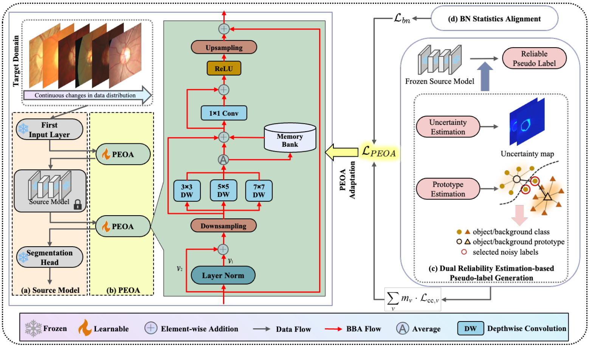

<div align="center">

<div class="logo">
   <a href="https://github.com/anonymous/BBA_CTA">
      
   </a>
</div>

<h1>Beyond Visual Prompt: Unlocking Black-Box Adapter for Continual Test-Time Adaptation in Medical Anatomical Region Segmentation</h1>


💡 In medical image segmentation, BBA can be integrated into any frozen source model in a black-box manner, without accessing its internal architecture or parameters, enabling continual adaptation of the model to the target domain.


</div>


## 🧠 Core Features

**Plug-and-Play**: Seamlessly attachable to any source model without architectural modification.

**Black-Box Compatible**: Requires no access to model architecture details or gradient propagation.

**Domain-Aware Adaptation**: Dynamically adjusts predictions based on target domain-specific features.

**Dual Reliability Learning**: Enhances pseudo-label reliability through prototype clustering and uncertainty estimation.

**BN Statistics Alignment**: Aligns feature distributions across domains via batch normalization statistics to mitigate performance drift.

**Defense Against Catastrophic Forgetting and Error Accumulation**: Prevents model degradation over prolonged CTA processes.


<h2 style="text-align: left;">📌 Updates</h2>

**2025.08.03**: Modified docstr.  
**2025.08.02**: Upload the code for OD&OC segmentation.  
**2025.03.06**: Repository created.

## ✅ TODO  
- [ ] **Release brain tumor segmentation code.**  
- [x] **Code will be released soon.** 


## 📖 Overview  

Comparison of BBA-CTA with traditional CTA
methods: it freezes source model parameters to avoid error
accumulation and catastrophic forgetting, and adapts each
test image via BBA. Unlike prompt-based methods, it effectively overcomes semantic insufficiency.

<div class="logo">
   <a href="https://github.com/anonymous/BBA_CTA">
      
   </a>
</div>

## 🛠️ Dependencies & Installation  

### 1️⃣ Clone the Repository  
```bash
git clone git@github.com:anonymous/BBA_CTA.git
cd BBA_CTA
```

### 2️⃣ Create Conda Environment & Install Dependencies  
```bash
conda create -n BBA python=3.8 -y  
conda activate BBA 
pip3 install -r requirements.txt  
```

## 🚀 Get Started  

### 📂 Dataset Preparation  

- Download the OD and OC segmentation dataset using the following command:
```bash
wget https://oneflow-static.oss-cn-beijing.aliyuncs.com/data_lx/Fundus.zip
```

### ⚡ Quick Test 🏂  

- Dual reliability estimation-based pseudo-label generation:
```bash
python3 generate_pseudo/generate_pseudo.py --save-visualization
```

- Run the following command to perform a quick inference:  
```bash
bash bba_cta_optic.sh
```

## 📊 Results  

The performance of our method, BBA-CTA, and five competing methods on the OD/OC segmentation task in long-term CTA. The best results are highlighted in **bold**. Performance degradation is calculated by the difference between the overall average DICE and the average DICE of round 1. ‘Ave.’ is the abbreviation for ‘Average’:

| Round    | 1                            | 1                            | 1                            | 1                            | 1                            | 1    | 2                            | 2                            | 2                            | 2                            | 2                            | 2    | 3                            | 3                            | 3                            | 3                            | 3                            | 3    | Ave. DICE ↑  | Perform. Degra. ↓ |
|----------|-----------------------------|-----------------------------|-----------------------------|-----------------------------|-----------------------------|------|-----------------------------|-----------------------------|-----------------------------|-----------------------------|-----------------------------|------|-----------------------------|-----------------------------|-----------------------------|-----------------------------|-----------------------------|------|-------------|------------------|
| Methods  | A                            | B                            | C                            | D                            | E                            | Ave. | A                            | B                            | C                            | D                            | E                            | Ave. | A                            | B                            | C                            | D                            | E                            | Ave. |             |                  |
| No Adapt | 64.53                         | 76.06                         | 71.18                         | 52.67                         | 64.87                         | 65.86 | 64.53                         | 76.06                         | 71.18                         | 52.67                         | 64.87                         | 65.86 | 64.53                         | 76.06                         | 71.18                         | 52.67                         | 64.87                         | 65.86 | 65.86       | -                |
| TENT     | 73.07                         | 78.66                         | 71.94                         | 46.81                         | 70.20                         | 68.13 | 62.09                         | 69.32                         | 70.67                         | 39.02                         | 68.22                         | 61.86 | 57.05                         | 62.47                         | 70.20                         | 39.02                         | 66.37                         | 59.02 | 63.01 (-2.85) | 5.12             |
| CoTTA    | 75.39                         | 75.98                         | 69.14                         | 53.99                         | 70.40                         | 68.98 | 74.31                         | 75.00                         | 67.99                         | 51.04                         | 68.28                         | 67.32 | 73.22                         | 74.33                         | 66.72                         | 50.23                         | 67.08                         | 66.32 | 67.54 (+1.68) | 1.44             |
| DLTTA    | 75.11                         | 78.85                         | 73.89                         | 51.64                         | 69.71                         | 69.84 | 74.14                         | 79.65                         | 74.25                         | 45.05                         | 69.04                         | 68.43 | 72.28                         | 78.93                         | 72.87                         | 42.37                         | 69.26                         | 67.14 | 68.47 (+2.61) | 1.37             |
| SAR      | 74.55                         | 77.71                         | 70.78                         | 55.40                         | 71.72                         | 70.03 | 74.74                         | 78.09                         | 71.00                         | 52.13                         | 69.02                         | 69.00 | 74.90                         | 78.24                         | 71.18                         | 50.16                         | 68.44                         | 68.58 | 69.20 (+3.34) | 0.83             |
| VPTTA    | 73.91                         | 79.36                         | 74.51                         | 56.51                         | 75.35                         | 71.93 | 73.57                         | 78.84                         | 73.61                         | 56.91                         | 74.80                         | 71.55 | 73.12                         | 78.45                         | 72.63                         | 57.11                         | 74.04                         | 71.07 | 71.51 (+5.65) | 0.42             |
| **BBA-CTA** | **80.73** | **82.52** | **79.68** | **76.87** | **80.29** | **80.02** | **80.60** | **82.31** | **79.54** | **76.81** | **80.27** | **79.91** | **80.53** | **82.31** | **79.52** | **76.74** | **80.25** | **79.87** | **79.93 (+14.07)** | **0.09** |

## 📜 Citation (TODO)


## 📄 License  
The code and models are licensed under <a rel="license" href="./LICENSE">MIT License</a>. 

## 📬 Contact (anonymous)


## 🙌 Acknowledgement

The code is inspired by [VPTTA](https://github.com/Chen-Ziyang/VPTTA), [DLTTA](https://github.com/med-air/DLTTA), and [DomainAdaptor](https://github.com/koncle/DomainAdaptor).
